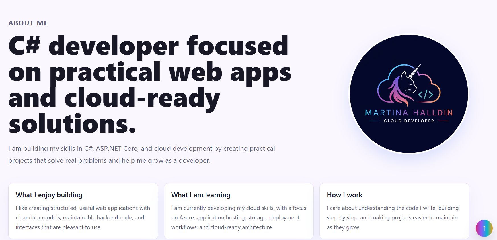
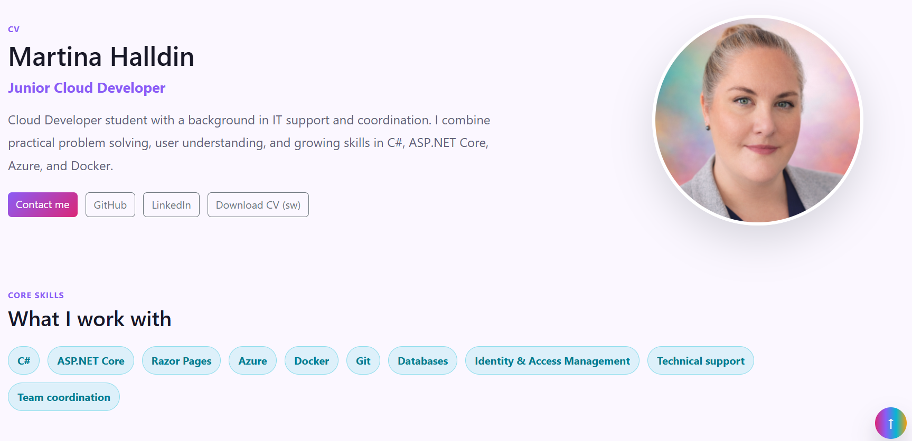
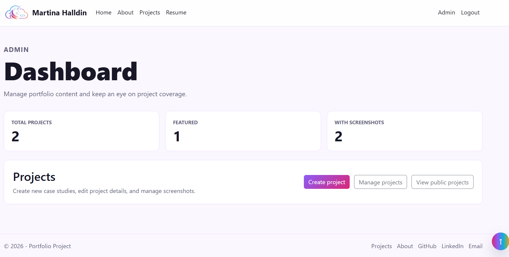

# Portfolio Project

[](https://github.com/ArtByMagicUnicorn/Portfolio-Project/actions/workflows/build.yml)

A personal portfolio platform built with ASP.NET Core Razor Pages, EF Core, SQLite, and Markdown.

The goal of this project is to keep my C# skills active while building something useful: a portfolio site where I can manage and present projects through a small admin area.



## Features

- Public project listing
- Project detail pages with slug-based URLs
- Project screenshots with fallback UI
- Project descriptions rendered from Markdown
- Admin dashboard with project overview
- Admin area for creating, editing, and deleting projects
- Markdown preview in admin forms
- Automatic slug generation from project titles
- Validation for required fields, URLs, and slug format
- Unique slugs for reliable project URLs
- Authentication for the admin area
- Local admin credentials handled using User Secrets
- About page with focus areas and contact links
- Resume page with downloadable CV
- Responsive footer with project and contact links
- GitHub Actions build validation
- Unit tests for slug generation
- Deployment checklist for future hosting
- Search and filtering for portfolio projects
- Custom 404 page
- Favicon and personal branding
- Project screenshots in README

## Tech Stack

- C#
- ASP.NET Core Razor Pages
- Entity Framework Core
- SQLite
- Markdig
- Bootstrap

## Project Structure

```text
Pages/
  Index
  About
  CV

  Projects/
    Index
    Details

  Admin/
    Index

    Projects/
      Index
      Create
      Edit
      Delete

  Account/
    Login
    Logout

Data/
  PortfolioDbContext

Models/
  PortfolioProject

Helpers/
  SlugHelper
  MarkdownHelper

PortfolioProject.Tests/
  SlugHelperTests

docs/
  deployment.md

  ```

## Getting Started

Clone the repository:

```
git clone https://github.com/ArtByMagicUnicorn/Portfolio-Project.git
cd "Portfolio-Project"
```

Restore packages:

```
dotnet restore
```

Apply database migrations:

```
dotnet ef database update
```

Run the app:

```
dotnet run
```

Then open the local URL shown in the terminal.

## Notes

The SQLite database file is not committed to source control. It is created locally from EF Core migrations.

## Screenshots

### About


### Resume



### Admin dashboard



## Featured Projects

- **Portfolio Engine** - The portfolio platform itself, built with Razor Pages, EF Core, SQLite, Markdown, authentication, admin CRUD, search, and GitHub Actions.

- **The Snaxers Luxury Chocolate** - A school project focused on cloud applications with Azure Container Apps, Cosmos DB, Blob Storage, Key Vault, Managed Identity, and Application Insights.

- **Tarot.Web** - An interactive tarot web application built with ASP.NET Core MVC, EF Core, SQLite, Razor Views, Bootstrap, and JSON-seeded card data.


## Roadmap

- Deploy the portfolio online
- Add Azure Blob Storage image uploads for project screenshots
- Add an English downloadable CV
- Improve admin dashboard statistics
- Add more portfolio projects
- Add richer project filtering or search
